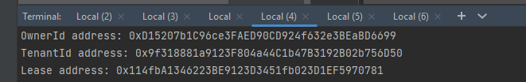
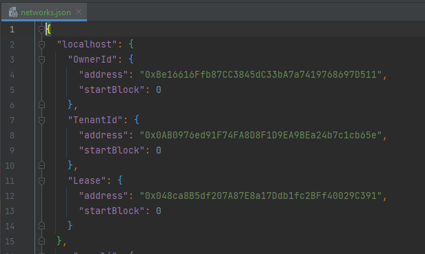

# Trust protocol Dapp

## How to set up a local environment
### General Settings
#### .env file

You need a ".env" file at the root of the project containing certain environment variables. An example
file ".env.example" has been provided with usable values for testing in local. Even a wallet seed is provided with testnet Ethers.

----
### Smart Contracts Settings
#### Open a terminal in the "/_contract URI folder_"

Execute the following commands:

> npm i
>
> npx hardhat node
>
Keep this terminal open and open a new one in the root folder of the project in the same directory
and execute the following command:

> npx hardhat deploy --fiat-rent-payment-eth --fiat-rent-payment-token --normal-rent --normal-token-rent --network localhost

The logs will print contract addresses as such:

Keep these at hand as you will need them in the next step.

---
### Sub-Graph Settings
Copy / Paste each contract address from the previous section to the following files at the root of the sub-graph directory:

- networks.json: Replace the corresponding addresses in the "localhost" section:

- subgraph.yaml: Replace the corresponding addresses in the "address" section:

#### Open a Docker container (Docker Desktop or terminal) and execute the following commands in the "/_sub-graph URI folder_":
(You need a bash able to execute sh commands. Linux & Mac have it natively, you can use GIT bash on WIndows for example)

> npm i
>
> sh run-graph-node.sh
>
Keep this terminal open and open a new one in  the same directory
and execute the following command:

> make regenerate

/!\ **Make sure to keep the "node" & "Docker" terminals open at all time during your use of the Dapp** /!\
## _You are now all set for runnintg the dapp :)_

