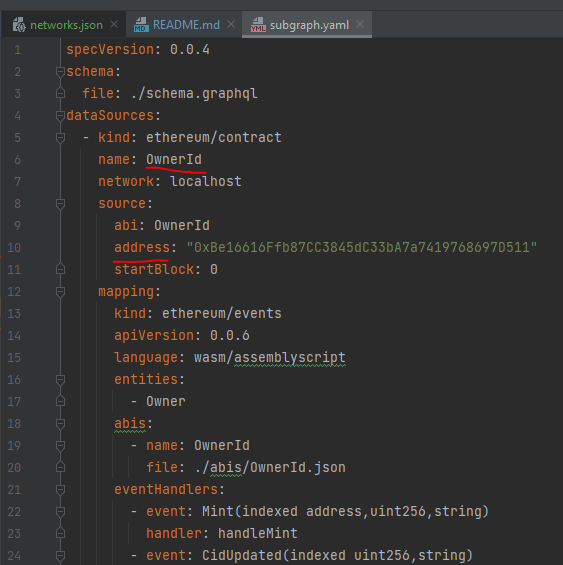

# Trust protocol Dapp

## Introduction
Trust protocol uses smart contracts hosted on the Ethereum blockchain to provide a decentralized, trustless, and transparent way to record rent payments between 2 parties.

---

## Technologies used
Our smart contracts are hosted on the ethereum blockchain - Using Meganode (NodeReal) as our node provider.

We use WalletConnect to allow users to connect their Ethereum wallet to our Dapp using the WalletConnect of their choice, including Ledger which can be connected through LedgerLive to sign transactions, create user and owner accounts, and transfer tokens for rent payment.

Trust protocol allows owners to ask for rent payments in any ERC20 token with a price indexed on Fiat currency; To offer a live exchange rate, our Dapp uses Iexec Oracles, generated through the Iexec Oracle Factory.
The protocol allows the addition of any number or oracle for conversion rates, and intends to offer more and more payment choices to users.

Our Smart contract addresses:

_Goerli:_

IexecRateOracle 0x243C3FEF3271F72884BF93eFf9af5b8D8A739815
ownerIdContract 0x2E2CfeA8A06c29a25B502F8D69498FbfbDE94F6c
tenantIdContract 0xE18a3Ed893361cAA3a207306197Ceebd47C6BcA5
ownerIdContract 0x01dbf024D566a5006a6eAFFaF7b286AF73dC6409
leaseContract 0xE7304dF39c9f861D0fe210f441Ded3f8Dd057440

Addresses on Goerli Scan:

https://goerli.etherscan.io/address/0x243C3FEF3271F72884BF93eFf9af5b8D8A739815
https://goerli.etherscan.io/address/0x01dbf024D566a5006a6eAFFaF7b286AF73dC6409
https://goerli.etherscan.io/address/0xE18a3Ed893361cAA3a207306197Ceebd47C6BcA5#readContract
https://goerli.etherscan.io/address/0xE7304dF39c9f861D0fe210f441Ded3f8Dd057440
https://goerli.etherscan.io/address/0x2E2CfeA8A06c29a25B502F8D69498FbfbDE94F6c#readContract

## How to set up a local environment
### General Settings
#### .env file
You need a ".env" file at the root of the project containing certain environment variables. An example
file ".env.example" has been provided with usable values for testing in local. Even a wallet seed is provided with testnet Ethers.
----
### Smart Contracts Settings
#### Open a terminal in the "/_contract URI folder_"

Execute the following commands:

> npm i
>
> npx hardhat node
>
Keep this terminal open and open a new one in the root folder of the project in the same directory
and execute the following command:

> npx hardhat deploy --fiat-rent-payment-eth --fiat-rent-payment-token --normal-rent --normal-token-rent --network localhost

The logs will print contract addresses as such:

Keep these at hand as you will need them in the next step.

---
### Sub-Graph Settings
Copy / Paste each contract address from the previous section to the following files at the root of the sub-graph directory:

- networks.json: Replace the corresponding addresses in the "localhost" section:

- subgraph.yaml: Replace the corresponding addresses in the "address" section:

#### Open a Docker container (Docker Desktop or terminal) and execute the following commands in the "/_sub-graph URI folder_":
(You need a bash able to execute sh commands. Linux & Mac have it natively, you can use GIT bash on WIndows for example)

> npm i
>
> sh run-graph-node.sh
>
Keep this terminal open and open a new one in  the same directory
and execute the following command:

> make regenerate

/!\ **Make sure to keep the "node" & "Docker" terminals open at all time during your use of the Dapp** /!\
## _You are now all set for runnintg the dapp :)_

